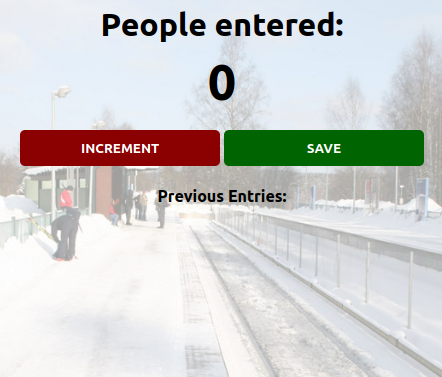

# Passenger Counter App

## Description
> This is an app that counts passengers at the station as they board the train.

## Setup Instructions
1. Click on the live link to view the website
2. Click on the Increment button to count a passenger
3. Click the save button to record that value

## Technologies used
- HTML
- CSS
- JavaScript

[^1]: ==Note that this is practice based on lessons from [Per Harald Borgen](https://scrimba.com/learn/learnjavascript)==
